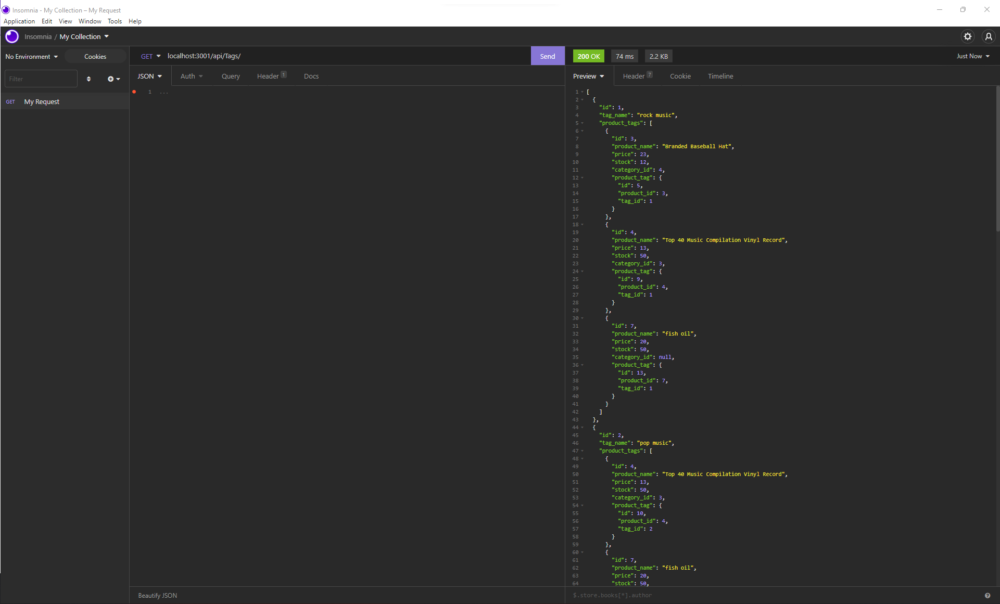

# e-commerce application backend

## Description

A comprehensive backend for an e-commerce system.  Routes for products, catagories and tags can be delivered to a front end to provide users with the ability to view and filter products.

## Requirements
* Nodejs
* Express
* Sequelize

## Usage
Application consists of 3 models, plus a junction model to bring together the many to many relationship between tags and products.

### Models
#### Category
* id
* category_name

#### Product
* id
* product_name
* price
* stock
* category_id

#### Tag
* id
* tag_name

#### ProductTag
--junction to connect product and tag--
* id
* tag_id
* product_id

### Routes

#### Category
/api/categories
* GET all ('/')
* GET by id (/:id)
* POST
* PUT ('/:id)
* DELETE ('/:id)

#### Product 
api/products
* GET all ('/')
* GET by id (/:id)
* POST
* PUT ('/:id)
* DELETE ('/:id)

#### Tag
/api/tags
* GET all ('/')
* GET by id (/:id)
* POST
* PUT ('/:id)
* DELETE ('/:id)

## Screenshot
